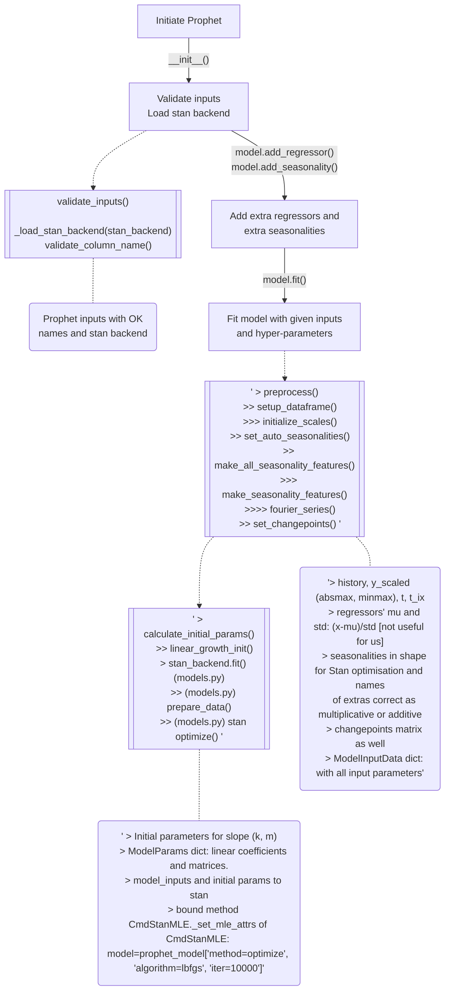

```mermaid

flowchart TD
    A -->|"__init__()"| B
    C -.- CC
    B -.-> C
    B -->|"model.add_regressor()
    model.add_seasonality()"| P
    P -->|"model.fit()"| D
    D -.-> E
    E -.-> K
    K -.- KK
    E -.- EE

    A[Initiate Prophet]

    B[Validate inputs
    Load stan backend]

    CC(Prophet inputs with OK
    names and stan backend)

    P[Add extra regressors and
    extra seasonalities]

    D[Fit model with given inputs
    and hyper-parameters]

    C[[" validate_inputs()
    _load_stan_backend(stan_backend)
    validate_column_name()
    "]]

    E[["' > preprocess()
    >> setup_dataframe()
    >>> initialize_scales()
    >> set_auto_seasonalities()
    >> make_all_seasonality_features()
    >>> make_seasonality_features()
    >>>> fourier_series()
    >> set_changepoints() '"]]

    K[["' > calculate_initial_params()
    >> linear_growth_init()
    > stan_backend.fit() (models.py)
    >> (models.py) prepare_data()
    >> (models.py) stan optimize() '"]]

    EE("'> history, y_scaled (absmax, minmax), t, t_ix
    > regressors' mu and std: (x-mu)/std [not useful for us]
    > seasonalities in shape for Stan optimisation and names
    of extras correct as multiplicative or additive
    > changepoints matrix as well
    > ModelInputData dict: with all input parameters'")

    KK("' > Initial parameters for slope (k, m)
    > ModelParams dict: linear coefficients and matrices.
    > model_inputs and initial params to stan
    > bound method CmdStanMLE._set_mle_attrs of CmdStanMLE: model=prophet_model['method=optimize', 'algorithm=lbfgs', 'iter=10000']'")


```