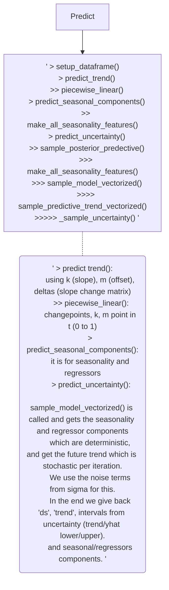

```mermaid

flowchart TD
    A --> B
    B -.- C


    A[Predict]

    B["' > setup_dataframe()
    > predict_trend()
    >> piecewise_linear()
    > predict_seasonal_components()
    >> make_all_seasonality_features()
    > predict_uncertainty()
    >> sample_posterior_predective()
    >>> make_all_seasonality_features()
    >>> sample_model_vectorized()
    >>>> sample_predictive_trend_vectorized()
    >>>>> _sample_uncertainty() '"]


    C("' > predict trend():
        using k (slope), m (offset), deltas (slope change matrix)
        >> piecewise_linear():
        changepoints, k, m point in t (0 to 1)
        > predict_seasonal_components():
        it is for seasonality and regressors
        > predict_uncertainty():
        sample_model_vectorized() is called and gets the seasonality and regressor components
        which are deterministic, and get the future trend which is stochastic per iteration.
        We use the noise terms from sigma for this.
        In the end we give back 'ds', 'trend', intervals from uncertainty (trend/yhat lower/upper).
        and seasonal/regressors components. '")


```